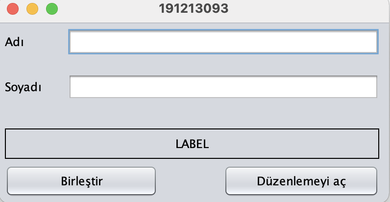
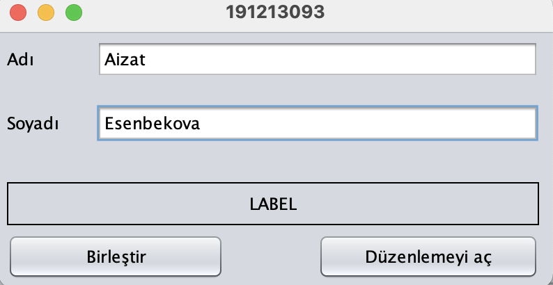
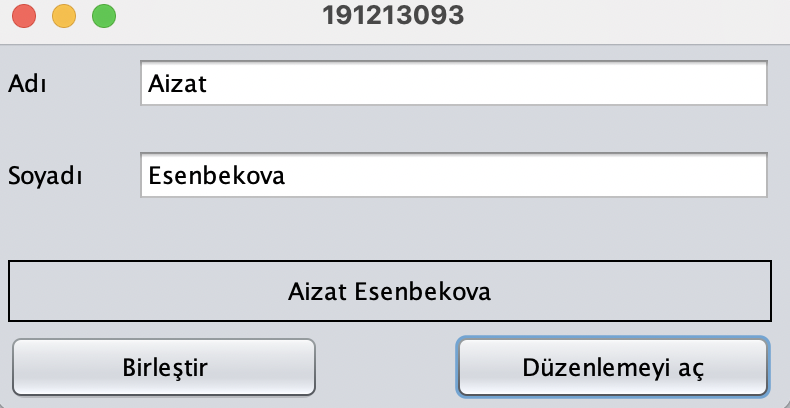
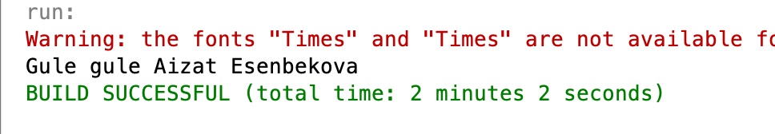

# Konya teknik üniveristesi birinci öğretim birinci lab sorusu
JFrame nesnesinin içine aşağıda görüldüğü gibi 2 adet JTextField, 2 adet jButton ve 3 adet JLabel eklenecektir.
Görsellik aşağıda verilen şekildeki gibi olacaktır ;
JFrame nesnesinin başlığına değer olarak öğrenci numaranızı veriniz.
jLabel nesnesinin kenar biçimlendirmesi için “Line Border” değerini veriniz. jLabel nesnesindeki metni ortalı olacak şekilde ayarlayınız.
 

 
Program çalıştırıldığında, form penceresi açılırken;
İlgili jtextfield nesnelerinin text değerlerine aşağıda görüldüğü gibi adınız ve soyadınız atanmalıdır.
İlgili jButton nesnelerinin text değerlerine de aşağıdaki görsele uygun olarak atamalar yapılmalıdır.
 

 
‘Birleştir’ butonuna basıldığında aşağıda verilen örnekte olduğu gibi Ad ve Soyad değerleri jLabel nesnesine yazdırılmalıdır.
Yazının rengi kırmızı olmalıdır. jTextfield alanları düzenlemeye kapatılmalıdır.
 
![image3])(images/3_1lab1.png)
 
‘Düzenlemeyi Aç’ butonuna basıldığında aşağıda verilen örnekte olduğu gibi JLabel üzerindeki yazının rengi siyah olmalıdır.
jTextfield alanları düzenlemeye açılmalıdır.
 

 
Pencere kapatılıyorken, jTextField nesnesinden alınan değer kullanılarak oluşturulan mesaj konsola yazdırılmalıdır.
 

