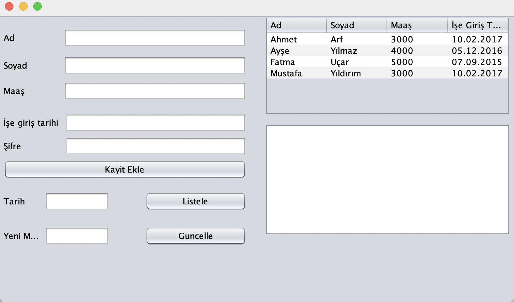
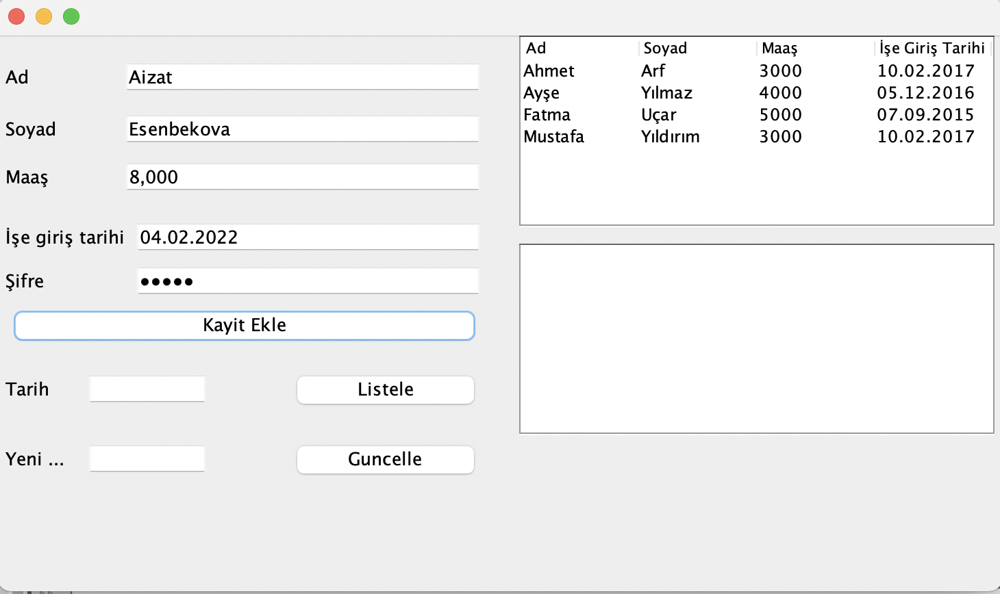
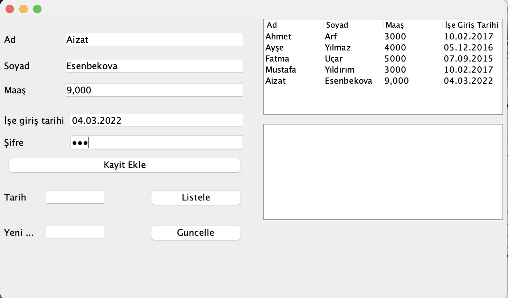
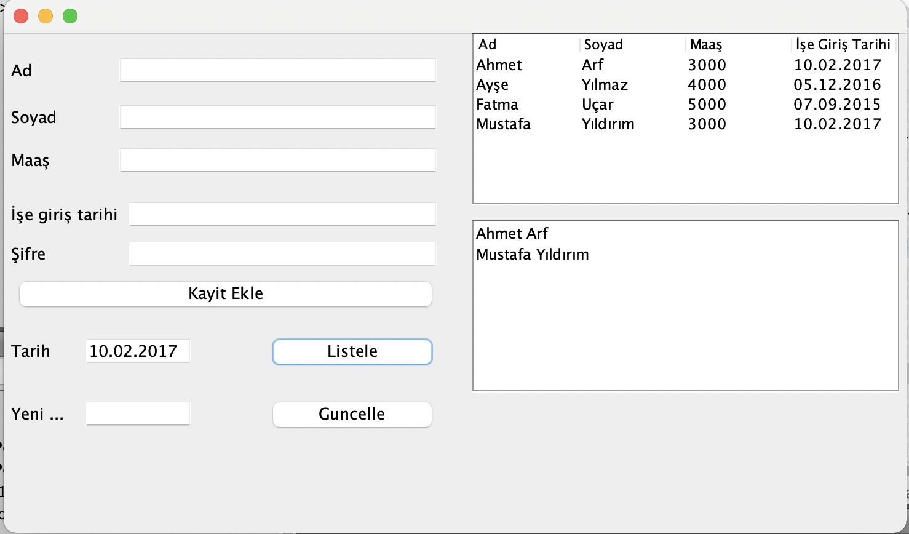
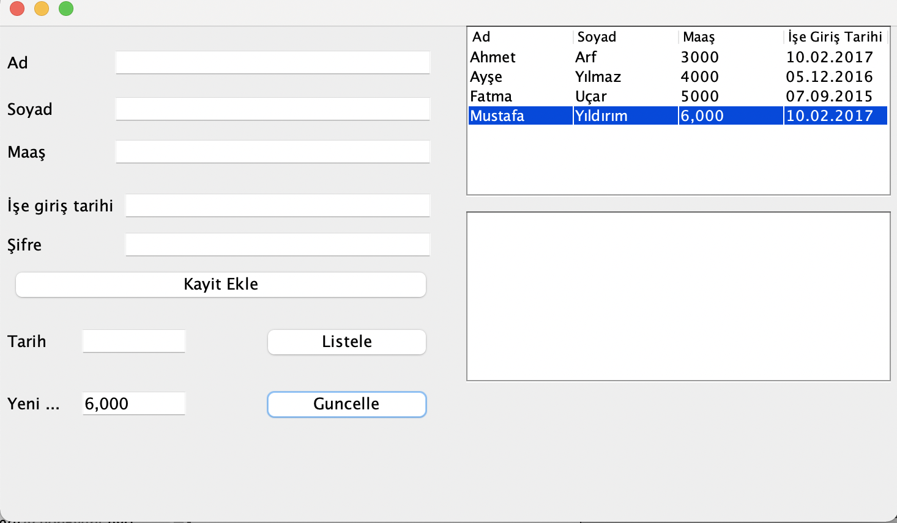

JFrame nesnesinin içine aşağıda görüldüğü gibi 7 adet Label 2 adet TextField, 4 adet JFormattedTextField, 1 adet JTable, 1 adet JList,
1 adet JPasswordField1 ve 3 adet Button eklenecektir.
Görsellik aşağıda verilen şekildeki gibi olacaktır ;
Maaş girilecek olan JFormattedTextField nesnelerin formatını “#,##0” olarak ayarlayınız. 
İşe Giriş Tarihi ve Tarih girilecek olan JFormatted TextField nesnelerin formatını “dd.MM.yyyy” olarak ayarlayınız.
JPasswordField nesnesi şifreyi gizleme karakterini “+‟ olarak ayarlayınız. 
JTable nesnesini aşağıda gösterilen şekilde düzenleyiniz ve default değerlerini giriniz.

 
“Kayıt Ekle” butonuna tıklandığında Şifre değeri “123” ise JTable nesnesindeki ilgili alanlara ilgili bilgiler eklenecek ve JPasswordField 
nesnesine girilen değer temizlenecek. Şifre “123” değilse hiçbir işlem yapılmayacak.

 
Tarih kısmına tabloda aranacak tarih değeri girilecektir. Listele butonuna basıldığında Tarih kısmına girilen değer ile tablodaki “İşe Giriş Tarihi” 
sütunundaki değeri aynı olan çalışanların Ad, Soyad kısmı List’e yazdırılacaktır.

Tablodan bir tane satır seçilmelidir. Güncelle butonuna basıldığında seçilen satırın maaş değeri “Yeni Maaş” alanına girilen maaş değeri ile güncellenmelidir.

