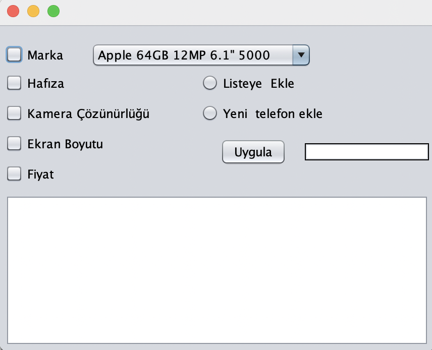
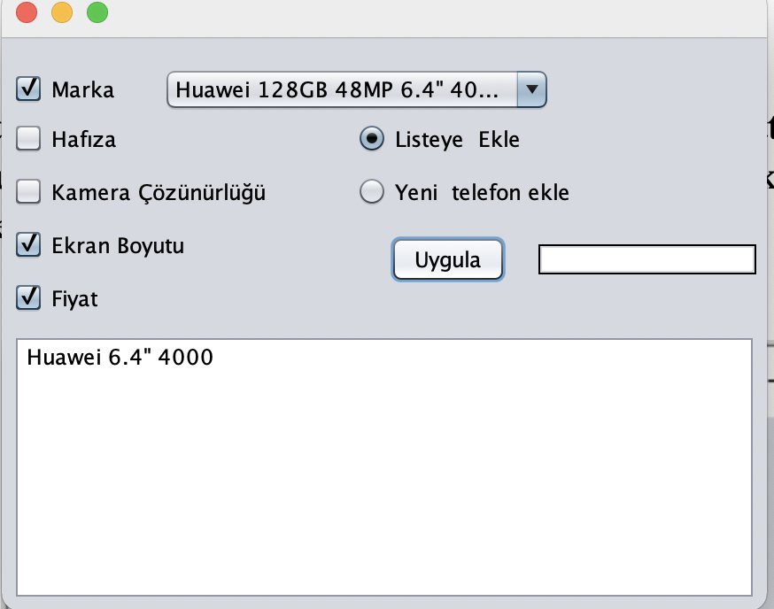
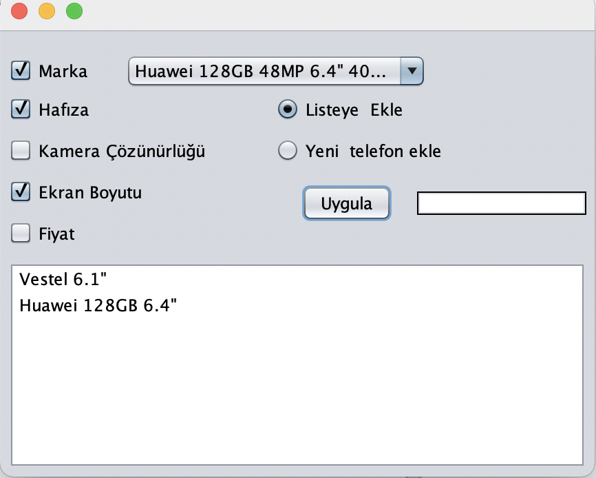
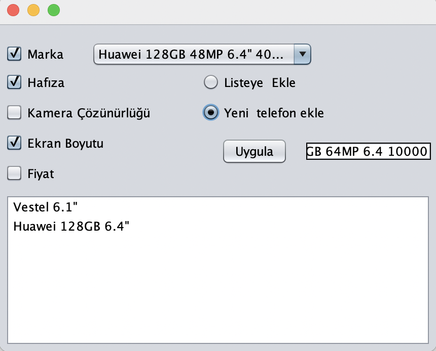
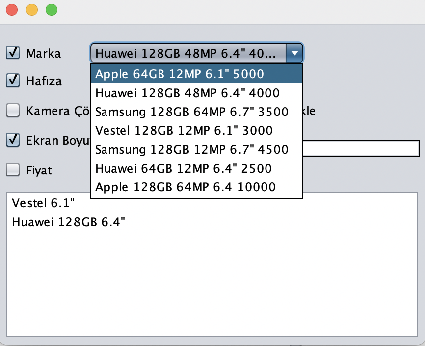

JFrame nesnesinin içine aşağıda görüldüğü gibi 5 adet CheckBox, 2 adet RadioButton, 1 adet ComboBox, 1 adet List, 1 adet TextField ve 1 adet Button eklenecektir.
Görsellik aşağıda verilen şekildeki gibi olacaktır (15 p);
TextField nesnesinin kenar biçimlendirmesi için “Line Border” değerini veriniz. RadioButton’ları yalnızca biri seçilebilecek şekilde ayarlayınız.
ComboBox nesnesine aşağıdaki elemanları ekleyiniz.
* Apple 64GB 12MP 6.1" 5000 
* Huawei 128GB 48MP 6.4" 4000 
* Samsung 128GB 64MP 6.7" 3500
* Vestel 128GB 12MP 6.1" 3000 
* Samsung 128GB 12MP 6.7" 4500 
* Huawei 64GB 12MP 6.4" 2500
 

 
‘Uygula butonuna basıldığında eğer “Listeye ekle” RadioButton’u seçiliyse aşağıda verilen örnekte olduğu gibi ComboBox’dan seçilen elemanın 
CheckBox’lardan seçilen özellikleri List’e eklenecektir. 
 

 
‘Uygula butonuna basıldığında eğer “Yeni telefon ekle” RadioButton’u seçiliyse aşağıda verilen örnekte olduğu gibi ComboBox’a, 
TextField’a yazılan telefon eklenecektir. 
 

