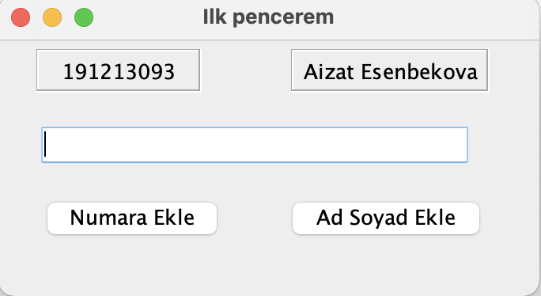
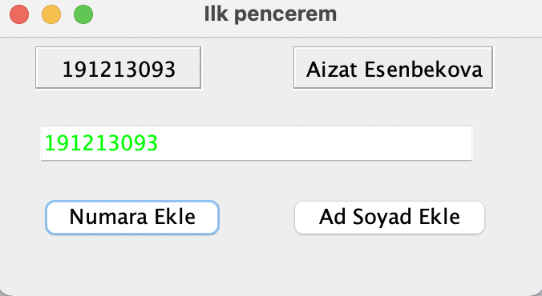
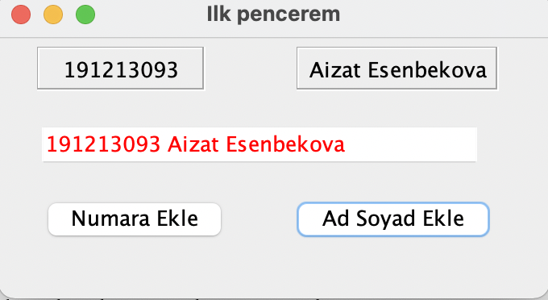
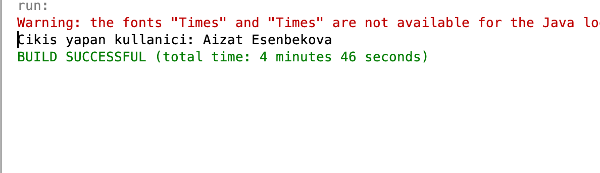

# Konya Teknik üniversitesi ikinci öğretim birinci lab quiz sorusu

JFrame nesnesinin içine aşağıda görüldüğü gibi 1 adet JTextField, 2 adet jButton ve 2 adet JLabel eklenecektir.
Görsellik aşağıda verilen şekildeki gibi olacaktır;
JFrame nesnesinin başlığına “İlk Pencerem” değerini veriniz.
jLabel nesnelerinin kenar biçimlendirmesi için “Etched Border” değerini veriniz. jLabel nesnelerindeki metinleri ortalı olacak şekilde ayarlayınız.
Program çalıştırıldığında, form penceresi açılırken;
İlgili jLabel nesnelerinin text değerlerine aşağıda görüldüğü gibi numaranız, adınız ve soyadınız atanmalıdır.
İlgili jButton nesnelerinin text değerlerine de aşağıdaki görsele uygun olarak atamalar yapılmalıdır.
 

 
‘Numara Ekle’ butonuna basıldığında aşağıda verilen örnekte olduğu gibi numara değeri jLabel nesnesine yazdırılmalıdır. 
Yazının rengi yeşil olmalıdır. jTextfield alanı düzenlemeye açılmalıdır
 

 
Ad ve Soyad Ekle’ butonuna basıldığında aşağıda verilen örnekte olduğu gibi ad ve soyad değerleri jLabel nesnesindeki değere eklenerek yazdırılmalıdır.
Yazının rengi kırmızı olmalıdır. jTextfield alanı düzenlemeye kapatılmalıdır 
 

 
Pencere kapatılıyorken, jLabel nesnesinden alınan değer kullanılarak oluşturulan mesaj konsola yazdırılmalıdır
 

 
Başarılar:)

