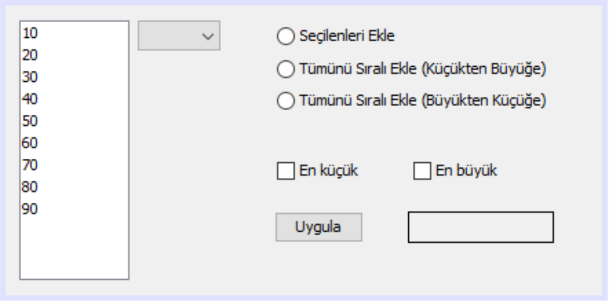
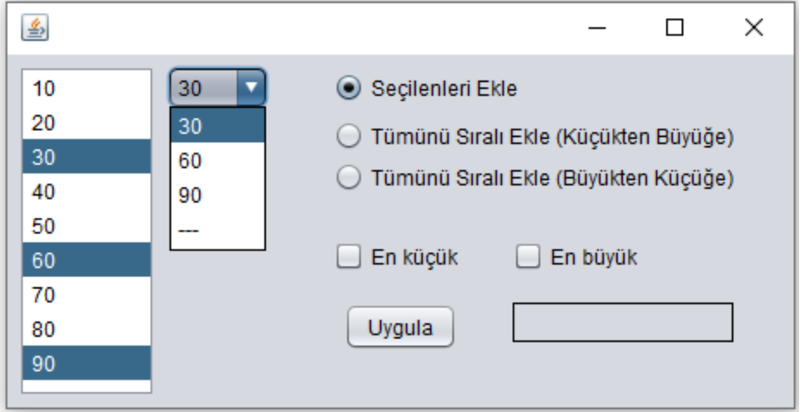
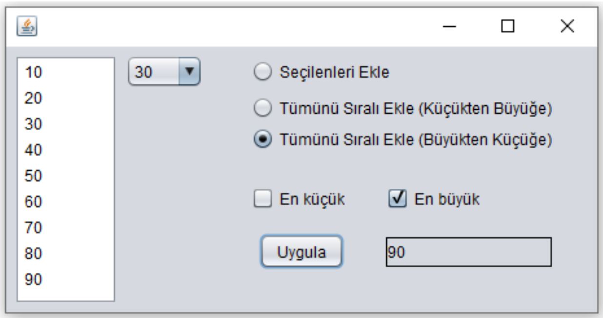
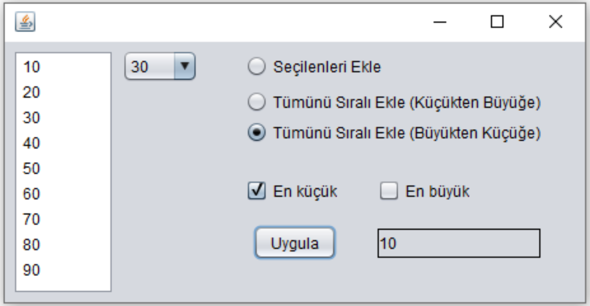

JFrame nesnesinin içine aşağıda görüldüğü gibi 1 adet List, 1 adet ComboBox, 3 adet RadioButton, 2 adet CheckBox, 1 adet Label ve 1 adet Button eklenecektir.
Görsellik aşağıda verilen şekildeki gibi olacaktır 
Label nesnelerinin kenar biçimlendirmesi için “Line Border” değerini veriniz. List nesnesine şekildeki elemanlar ekleyiniz.
RadioButton’lardan yalnızca biri seçilebilecek şekilde ayarlayınız. CheckBox’lardan yalnızca biri seçilebilecek şekilde ayarlayınız.

Uygula butonuna basıldığında eğer “Seçilenleri Ekle” RadioButton’u seçiliyse aşağıda verilen örnekte olduğu gibi List’den seçilen elemanlar ComboBox’a eklenecektir.

Uygula butonuna basıldığında eğer “Tümünü Sıralı Ekle (Küçükten Büyüğe)” RadioButton’u seçiliyse aşağıda verilen örnekte olduğu gibi List’deki tüm elemanlar ComboBox’a küçükten büyüğe sıralı olarak eklenecektir.

Uygula butonuna basıldığında eğer “Tümünü Sıralı Ekle (Büyükten Küçüğe)” RadioButton’u seçiliyse aşağıda verilen örnekte olduğu gibi List’deki tüm elemanlar ComboBox’a büyükten küçüğe sıralı olarak eklenecektir.

Uygula butonuna basıldığında eğer “En Büyük” CheckBox’ı seçiliyse aşağıda verilen örnekte olduğu gibi List’deki en büyük eleman Label’a yazdırılacaktır.

Uygula butonuna basıldığında eğer “En Büyük” CheckBox’ı seçiliyse aşağıda verilen örnekte olduğu gibi List’deki en küçük eleman Label’a yazdırılacaktır.

