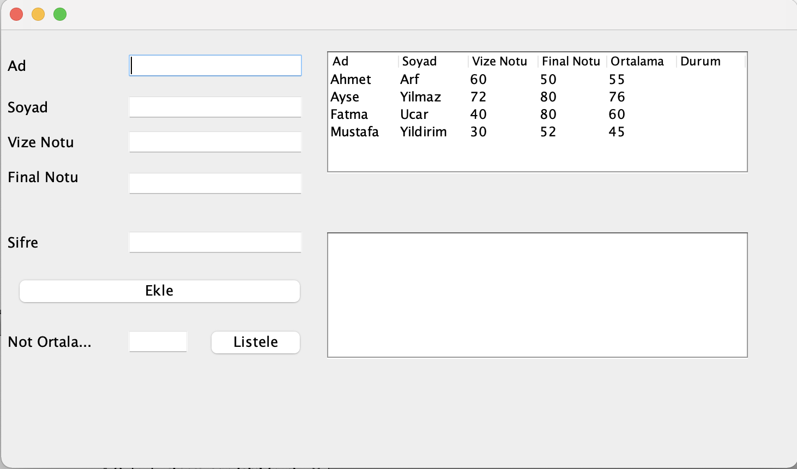
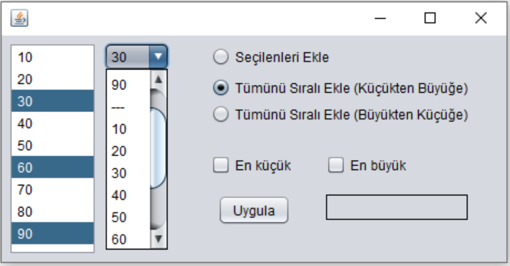
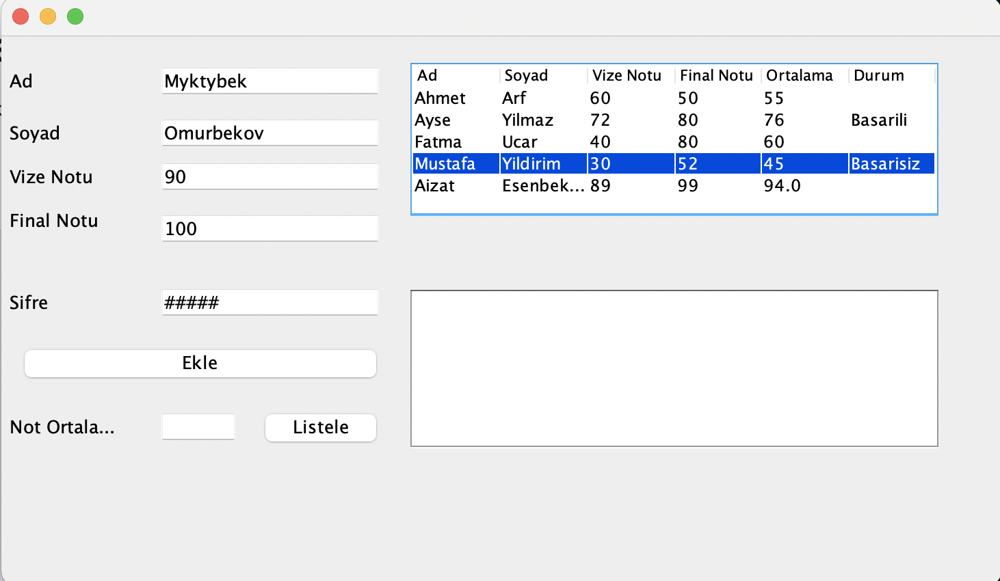
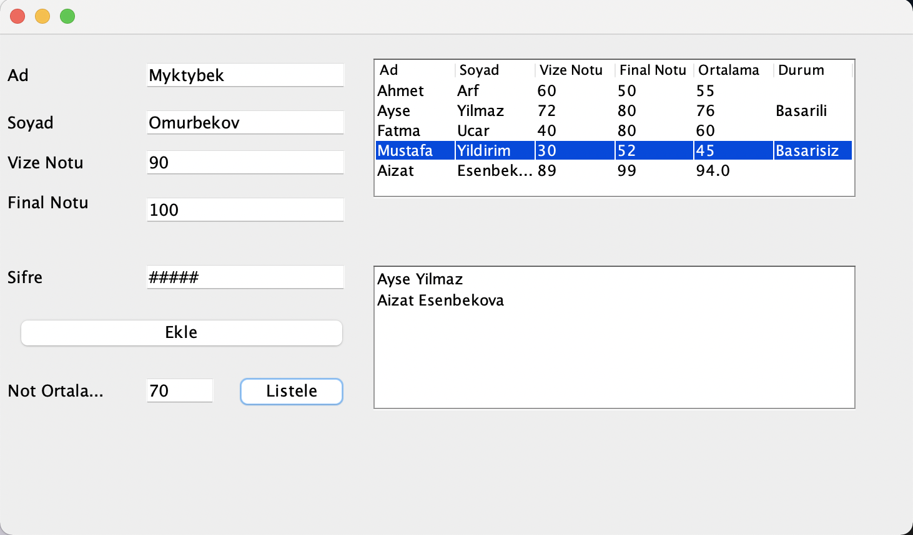

JFrame nesnesinin içine aşağıda görüldüğü gibi 6 ade JLabel 3 adet JTextField, 2 adet JFormattedTextField, 1 adet JTable, 1 adet JList, 1 adet JPasswordField ve 2 adet JButton eklenecektir.
Görsellik aşağıda verilen şekildeki gibi olacaktır;
Vize Notu ve Final Notu girilecek olan JFormattedTextField nesnelerin formatını “#,##0” olarak ayarlayınız.
JPasswordField nesnesi şifreyi gizleme karakterini “#‟ olarak ayarlayınız.
JTable nesnesini aşağıda gösterilen şekilde düzenleyiniz ve default değerlerini giriniz.

 
“Ekle” butonuna tıklandığında Şifre değeri “123” ise JTable nesnesindeki ilgili alanlara ilgili bilgiler eklenecek ve JPasswordField nesnesine girilen değer temizlenecek. Şifre “123” değilse hiçbir
işlem yapılmayacak. Tabloya Eklenecek olan Ad, Soyad, Vize Notu ve Final Notu arayüzden alınacaktır. Ortalama değeri ise vize notu ve final notunun ortalaması hesaplanarak tabloya yazdırılacaktır.
Durum sütunu boş bırakılacaktır.

 
Tablodaki bir satıra tıklandığında “Ortalama” sütunundaki değer 60 ve ya 60’dan büyükse “Durum” sütunundaki değerine “Başarılı”, 60’dan küçük ise “Durum” sütunundaki değerine “Başarısız” olarak 
yazdırılacaktır

 
Not ortalaması alanına bir değer girilmelidir. Ve Listele butonuna basıldığında “Ortalama” sütunundabulunan değerler“Notortalaması” alanına girilen değerile karşılaştırılır, “Ortalama” sütunundaki 
değeri büyük olan öğrencilerin Ad, Soyad kısmı JListe yazdıralacaktır.

